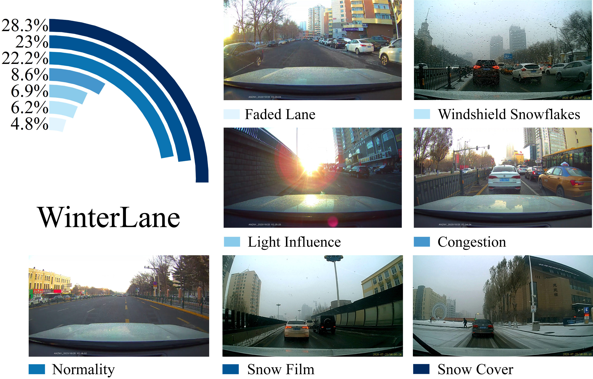
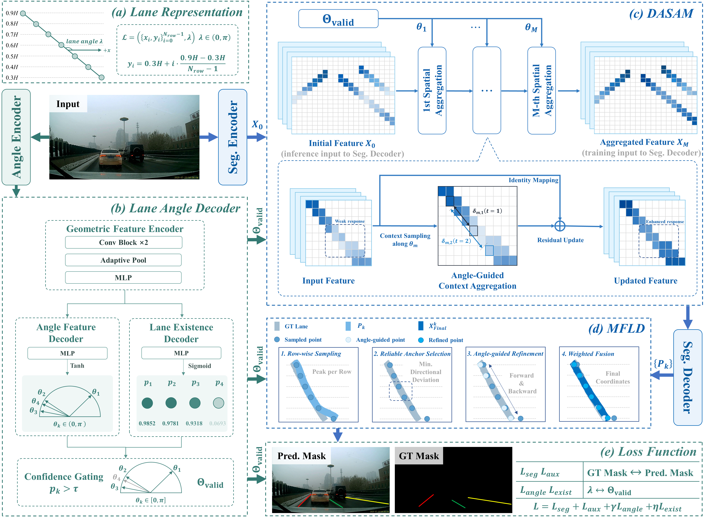
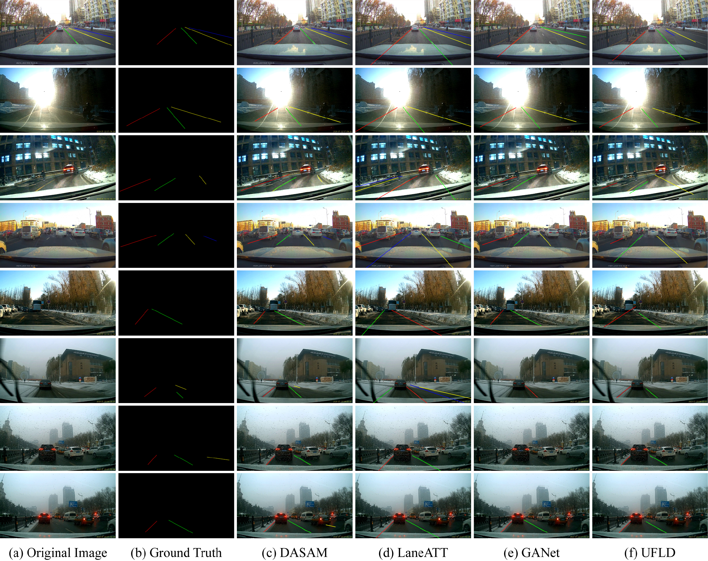

# WinterLane

**A Dynamic Angle-Aware Network with Multimodal Fusion for Robust Lane Detection in Snowy Environments**

Chengzhe Jiao<sup>1</sup>, Lina Wu<sup>2</sup>, Changyun Yang<sup>1</sup>, Yusheng Ci<sup>1</sup>, Ci Liang<sup>1</sup>

<sup>1</sup> School of Transportation Science and Engineering, Harbin Institute of Technology<br>
<sup>2</sup> School of Automobile and Traffic Engineering, Heilongjiang Institute of Technology

WinterLane is a research project on lane detection under snowy driving conditions. It includes a real-world dataset collected in Harbin, China, and a lane detection framework that uses predicted lane orientation to guide feature aggregation and coordinate refinement. This repository hosts the project page and demonstration materials.

**[Project page](https://hit-pathfinder-lab.github.io/WinterLane/)** · **[Download the dataset](https://zenodo.org/records/22985835)**

## Dataset

The WinterLane dataset was collected from 121 one-minute dashcam videos on urban and campus roads. It contains **11,895 lane-instance annotated images** at **1920 × 1080** resolution, split into **10,991 training images** and **904 test images**. Each image provides lane annotations, keypoint coordinates, instance masks, and annotation visualizations.

The dataset covers seven driving conditions: faded lanes, windshield snowflakes, light influence, congestion, normality, snow film, and snow cover. These conditions capture common challenges for lane detection in snowy environments, including obscured markings and reduced visibility.



The dataset is available from [Zenodo](https://zenodo.org/records/22985835).

### Dataset organization

The dataset is distributed as six separate archives on Zenodo. Download and extract all six, then arrange their contents under one dataset root with the following structure:

```text
WinterLane/
├── List/
│   ├── train.txt
│   ├── train_gt.txt
│   ├── test.txt
│   └── test_split/
│       ├── test0_Normal.txt
│       ├── test1_Light_Influence.txt
│       └── ...
├── Train/
│   ├── json/
│   ├── label/
│   ├── pic/
│   └── png/
└── Test/
    ├── Normal/
    ├── Light_Influence/
    ├── Congestion/
    ├── Lane_Line_Blur/
    ├── Snow_Cover/
    ├── Windshield_Snow_Stgnation/
    └── Snow_Film_Effect/
        ├── json/
        ├── label/
        ├── pic/
        └── png/
```

Each category under `Test/` contains its own `json/`, `label/`, `pic/`, and `png/` directories; only one category is expanded in the tree above. Place the contents of `List.zip` in `List/`, `Test.zip` in `Test/`, and the four training archives in the matching directories: `Train_json.zip` → `Train/json/`, `Train_label.zip` → `Train/label/`, `Train_pic.zip` → `Train/pic/`, and `Train_png.zip` → `Train/png/`. Avoid an extra nested level such as `Train/Train_pic/pic/`.

The paths in `List/train.txt`, `List/train_gt.txt`, and `List/test.txt` are relative to the dataset root. For example, `\Train\pic\36_1_frame.jpg` refers to `WinterLane/Train/pic/36_1_frame.jpg` in the layout above.

## Method

The proposed framework predicts lane orientation and uses it to support lane detection. Its **DASAM** component aggregates contextual features along predicted lane directions during training. **MFLD** combines lane probability maps and global orientation angles through anchor selection, refinement, and coordinate fusion to produce lane coordinates.



## Qualitative results

The examples below compare lane detections across eight road scenes, including normal driving, glare, nighttime, congestion, faded lanes, snow cover, windshield snowflakes, and snow film. Each row shows the input image, ground-truth lane mask, and predictions from DASAM, LaneATT, GANet, and UFLD.

[](docs/assets/images/results.png)

Click the figure to view it at full resolution. More demonstrations and comparisons are available on the [project page](https://hit-pathfinder-lab.github.io/WinterLane/).
